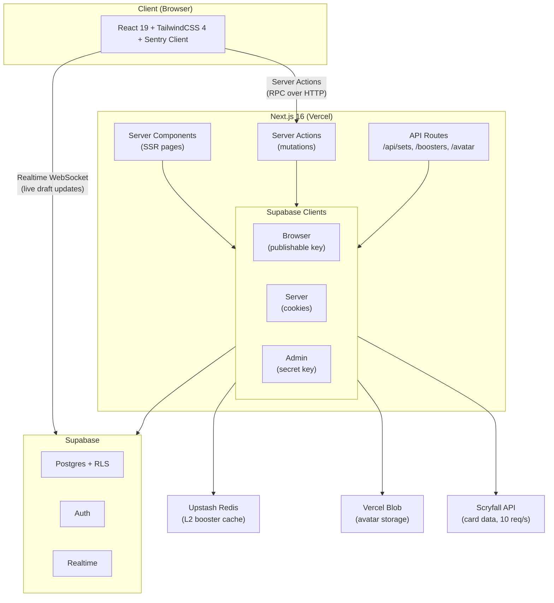
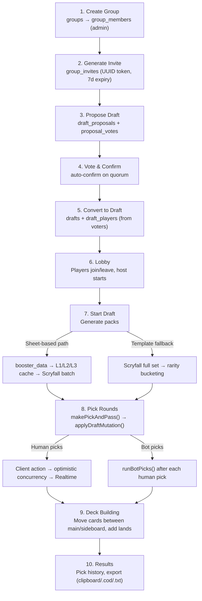
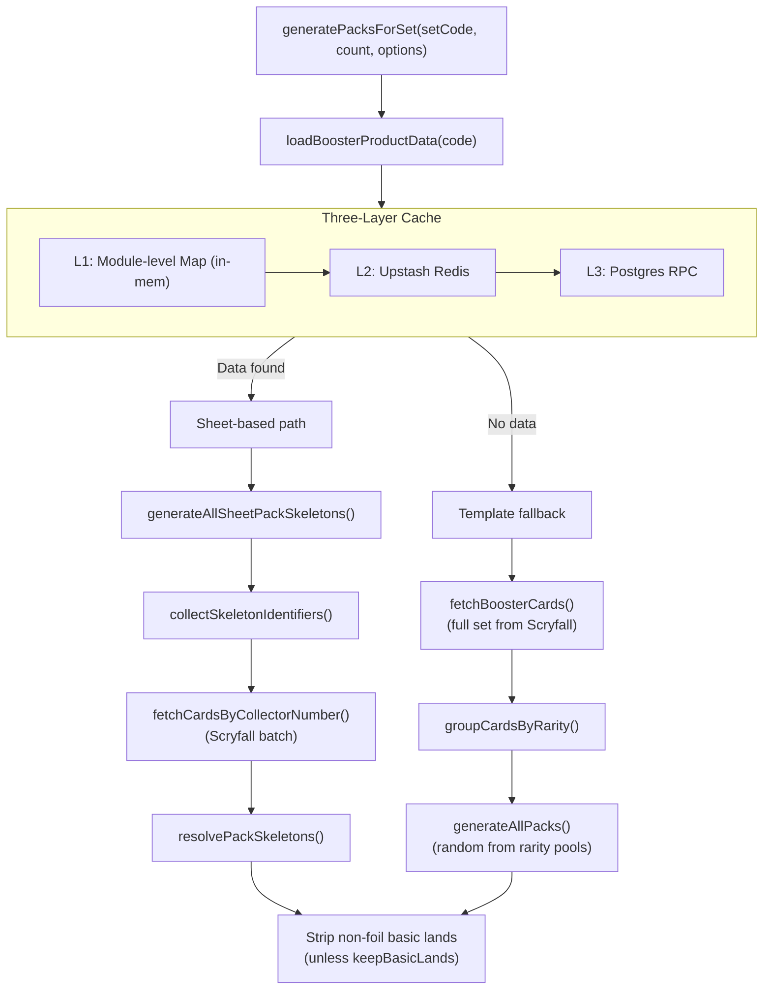
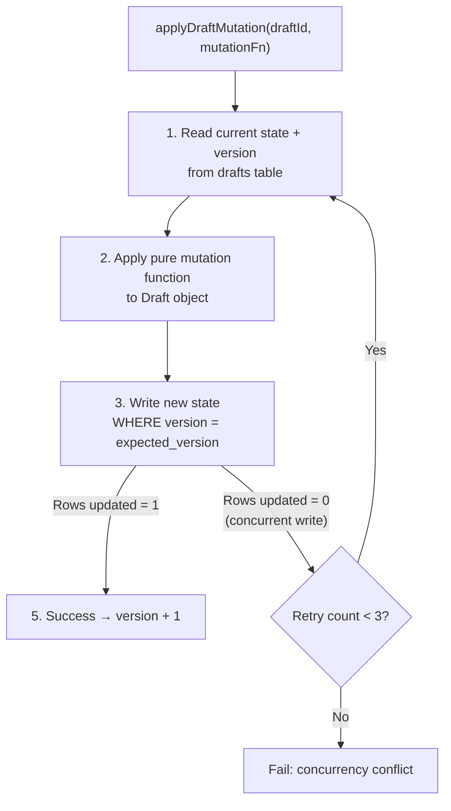
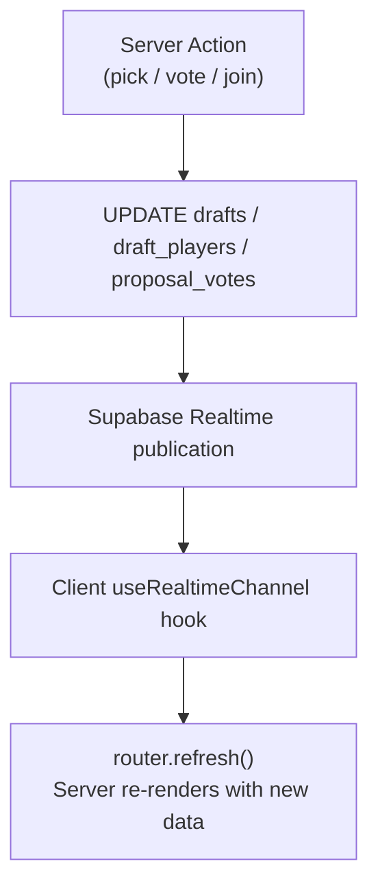
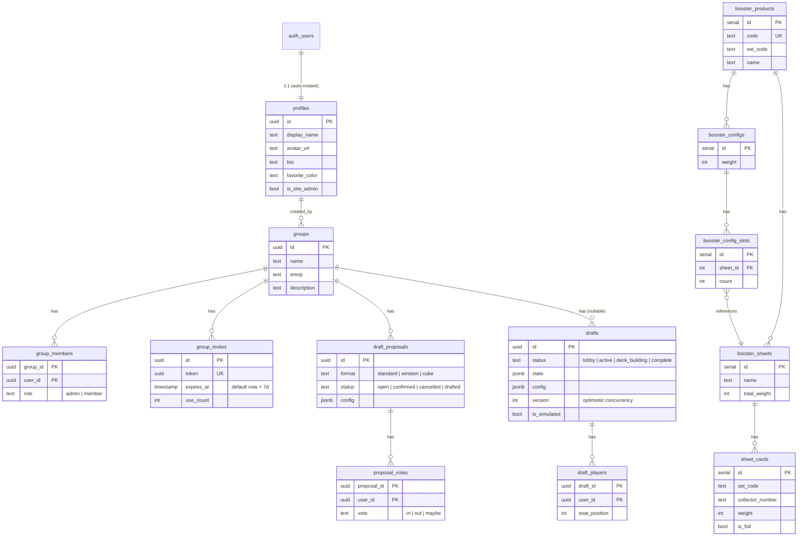
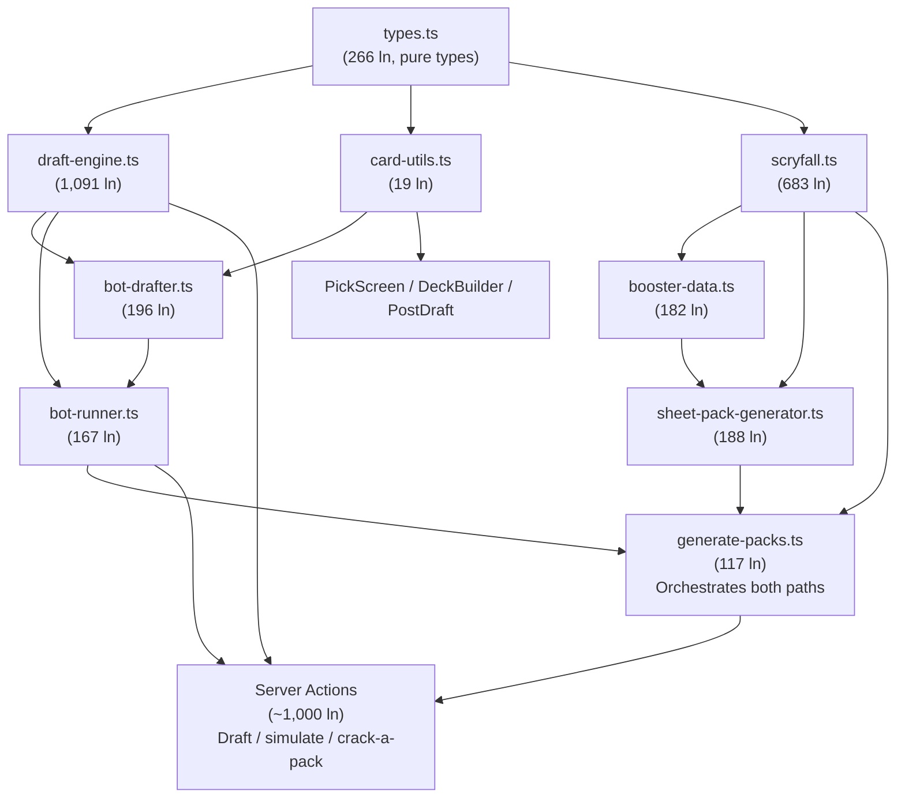

# podman — Comprehensive Codebase Analysis

Generated: February 16, 2026

---

## 1. Project Overview

**podman** is a real-time multiplayer Magic: The Gathering (MTG) draft web application. Players create groups, propose drafts, open booster packs, pick cards in timed rounds, build decks, and export them — all through a mobile-first responsive UI.

| Attribute | Value |
|---|---|
| **Type** | Full-stack web application (SPA + SSR) |
| **Architecture** | Next.js App Router (server components + server actions + client components) |
| **Language** | TypeScript (strict mode, zero `any` types) |
| **Frontend** | React 19 + TailwindCSS 4 |
| **Backend** | Next.js Server Actions + Supabase (Postgres + Auth + Realtime) |
| **Hosting** | Vercel (app) + Supabase (database) + Upstash Redis (cache) + Vercel Blob (avatars) |
| **Domain** | `www.podman.app` (production) |
| **Source lines** | ~15,000 (application code, excluding generated/vendor) |
| **Test coverage** | 207 unit tests (Vitest) |

### Supported Draft Formats

- **Standard Draft** (1-8 players): Open 3 packs, pick one card per round, pass remaining to neighbor
- **Winston Draft** (2 players): Three face-down piles, take-or-pass mechanic
- **Cube Draft**: Player-supplied card lists (text or CubeCobra import)
- **Simulated Drafts**: Play against AI bots in any format
- **Crack a Pack**: Standalone pack opening for any set/product type

---

## 2. Technology Stack

### Runtime & Frameworks

| Technology | Version | Role |
|---|---|---|
| Node.js | 22 | Runtime (CI) |
| Next.js | 16.1.6 | Full-stack React framework (App Router) |
| React | 19.2.4 | UI library |
| TypeScript | 5.x | Language (strict mode) |
| TailwindCSS | 4.x | Utility-first CSS (via `@tailwindcss/postcss`) |

### Backend Services

| Service | Role |
|---|---|
| Supabase (Postgres) | Primary database with RLS, SECURITY DEFINER RPCs |
| Supabase Auth | Email/password authentication (no OAuth, no email confirmation) |
| Supabase Realtime | Live draft updates (pick notifications, lobby joins, vote changes) |
| Upstash Redis | L2 cache for booster distribution data |
| Vercel Blob | Avatar image storage |
| Sentry | Error monitoring (client + server + edge) |

### Dev & Build Tools

| Tool | Role |
|---|---|
| Vitest | Unit testing (207 tests) |
| ESLint (v9) | Linting (flat config, `next/core-web-vitals` + `next/typescript`) |
| PostCSS | CSS processing (Tailwind v4 plugin) |
| tsx | TypeScript script runner (data scripts) |
| GitHub Actions | CI (lint + build + test on PRs), daily set sync |
| Vercel | Deployment (auto-deploy on push, PR previews) |

### Key Libraries

| Library | Purpose |
|---|---|
| `@supabase/ssr` | Server-side Supabase client with cookie auth |
| `@supabase/supabase-js` | Admin client (service role, bypasses RLS) |
| `@upstash/redis` | Redis client for booster data cache |
| `@vercel/blob` | Avatar image uploads |
| `@sentry/nextjs` | Error monitoring with source maps |
| `mana-font` | MTG mana symbol icons |
| `keyrune` | MTG set symbol icons |
| `chalk` / `ora` / `cli-table3` | CLI script formatting (dev dependencies) |

---

## 3. Directory Structure

```
podman/
├── .github/workflows/         # CI + daily set sync
│   ├── ci.yml                 # Lint + build + test on PRs
│   └── update-sets.yml        # Daily booster data sync (10:00 UTC)
├── docs/                      # Documentation
│   ├── archive/               # Archived reference docs
│   ├── plans/                 # Implementation plans
│   ├── booster-data.md        # Booster data system docs
│   └── collector-number-suffix-fix.md
├── public/                    # Static assets
│   └── manifest.json          # PWA manifest (standalone display)
├── scripts/                   # Data management scripts (6 files)
│   ├── supabase-api.ts        # Shared Supabase Management API utilities
│   ├── backup-prod.ts         # Export production data to JSON
│   ├── restore-prod.ts        # Restore from backup
│   ├── sync-staging.ts        # Mirror prod → staging
│   ├── load-booster-data.ts   # ETL for booster distribution data
│   └── test-packs.ts          # Pack generation validation
├── src/
│   ├── app/                   # Next.js App Router (routes, layouts, actions)
│   │   ├── layout.tsx         # Root layout (HTML shell, metadata, Sentry)
│   │   ├── globals.css        # Tailwind + custom properties
│   │   ├── global-error.tsx   # Sentry error boundary
│   │   ├── page.tsx           # Root redirect (→ dashboard or login)
│   │   ├── auth/              # Login, signup, signout
│   │   ├── invite/[token]/    # Public invite landing pages
│   │   ├── api/               # REST endpoints (sets, boosters, avatar)
│   │   └── (app)/             # Auth-protected routes
│   │       ├── layout.tsx     # App shell (header, avatar, sign out)
│   │       ├── dashboard/     # Groups, proposals, profile, simulate, admin
│   │       ├── draft/[draftId]/ # Draft flow (lobby → pick → deck → results)
│   │       └── crack-a-pack/  # Standalone pack opening
│   ├── lib/                   # Core logic & utilities (~16 files)
│   │   ├── types.ts           # All TypeScript type definitions
│   │   ├── database.types.ts  # Auto-generated Supabase types
│   │   ├── draft-engine.ts    # Pure draft state machine (1,091 lines)
│   │   ├── scryfall.ts        # Rate-limited Scryfall API client
│   │   ├── pack-generator.ts  # Template-based pack generation
│   │   ├── sheet-pack-generator.ts # Booster sheet-based generation
│   │   ├── generate-packs.ts  # Pack generation orchestrator
│   │   ├── booster-data.ts    # Three-layer booster cache
│   │   ├── bot-drafter.ts     # AI bot picking algorithm
│   │   ├── bot-runner.ts      # Bot turn orchestration
│   │   ├── card-utils.ts      # Shared card helpers
│   │   ├── export.ts          # Deck export (text, .cod, clipboard)
│   │   ├── kv.ts              # Upstash Redis wrapper
│   │   ├── supabase.ts        # Browser Supabase client
│   │   ├── supabase-server.ts # Server Supabase client (cookie auth)
│   │   ├── supabase-admin.ts  # Admin client (bypasses RLS)
│   │   ├── supabase-middleware.ts # Auth middleware
│   │   ├── admin-guard.ts     # Site admin check
│   │   └── __tests__/         # 7 test files (207 tests)
│   ├── components/            # React components (~17 files)
│   │   ├── ui/                # Shared UI (UserAvatar, CardThumbnail, Timer, etc.)
│   │   ├── draft/             # Draft-specific (PickScreen, DraftLobby, etc.)
│   │   └── deck-builder/      # DeckBuilderScreen
│   └── hooks/                 # Custom React hooks (3 files)
│       ├── useCarousel.ts     # Touch carousel physics
│       ├── useFocusTrap.ts    # Modal focus management
│       └── useRealtimeChannel.ts # Supabase Realtime lifecycle
├── supabase/
│   ├── config.toml            # Local Supabase config
│   ├── seed.sql               # Bootstrap seed (admin invite)
│   └── migrations/            # 13 SQL migration files
├── next.config.ts             # Next.js + Sentry config
├── vitest.config.ts           # Vitest path alias config
├── eslint.config.mjs          # ESLint flat config
├── postcss.config.mjs         # Tailwind v4 PostCSS plugin
├── tsconfig.json              # TypeScript strict config
├── sentry.server.config.ts    # Sentry server init
├── sentry.edge.config.ts      # Sentry edge init
└── package.json               # Dependencies & scripts
```

---

## 4. Architecture Deep Dive

### 4.1 High-Level System Architecture



### 4.2 Data Flow: Draft Lifecycle



### 4.3 Pack Generation Pipeline

The pack generation system uses a two-path strategy:



### 4.4 Optimistic Concurrency Model

Draft state mutations use a compare-and-swap pattern:



This prevents two players' picks from conflicting — the second write sees a version mismatch and retries with fresh state.

### 4.5 Realtime Architecture



Four tables are published to Realtime: `drafts`, `draft_players`, `draft_proposals`, `proposal_votes`. Client components subscribe to changes and trigger a full server re-render via `router.refresh()`, which re-runs server components with fresh database reads.

---

## 5. Database Schema

### 5.1 Entity-Relationship Overview



### 5.2 Tables Summary

| Table | PK | Rows (est.) | RLS | Purpose |
|---|---|---|---|---|
| `profiles` | uuid (FK auth.users) | ~10 | Own-row update, all-read | User profiles (auto-created on signup) |
| `groups` | uuid | ~5 | Member read, admin update | Draft groups |
| `group_members` | (group_id, user_id) | ~15 | Member read, admin write | Group membership |
| `group_invites` | uuid | ~10 | Admin only (RPCs for public access) | Time-limited invite tokens |
| `draft_proposals` | uuid | ~20 | Member scoped | Draft scheduling proposals |
| `proposal_votes` | (proposal_id, user_id) | ~40 | Member scoped | Votes on proposals |
| `drafts` | uuid | ~30 | Participant scoped + host write | Draft state (JSONB `state` column) |
| `draft_players` | (draft_id, user_id) | ~60 | Participant scoped | Draft participation |
| `booster_products` | serial | ~300 | Read-only (authenticated) | MTG booster product catalog |
| `booster_configs` | serial | ~1,500 | Read-only | Weighted pack configurations |
| `booster_config_slots` | serial | ~15,000 | Read-only | Slots within pack configs |
| `booster_sheets` | serial | ~6,000 | Read-only | Named card groups per product |
| `sheet_cards` | serial | ~300,000 | Read-only | Individual cards with weights |

### 5.3 Security Architecture

**SECURITY DEFINER Functions (6 active):**

| Function | Accessible To | Purpose |
|---|---|---|
| `accept_group_invite(token)` | authenticated | Join group via invite token |
| `get_invite_info(token)` | anon + authenticated | View group info for invite page |
| `get_booster_product_json(code)` | authenticated | L3 cache: full booster data as JSONB |
| `user_group_ids(user_id)` | RLS internal | Break recursion in group_members policies |
| `user_draft_ids(user_id)` | RLS internal | Break recursion in draft_players policies |
| `is_group_admin(group_id, user_id)` | RLS internal | Admin check without recursion |

All SECURITY DEFINER functions use `SET search_path = ''` to prevent search_path injection.

**RLS Design Principles:**
- Profiles: All authenticated users can read (needed for display names). Own-row updates only.
- Group resources: Scoped to membership via `user_group_ids()` helper.
- Draft resources: Scoped to participation via `user_draft_ids()` helper.
- Booster data: Read-only for authenticated users. Writes via service role only.

### 5.4 Migration History

13 migration files, applied in chronological order:

| Migration | Description |
|---|---|
| `20260211000000_initial_schema` | All core tables, RLS, triggers (profiles auto-create) |
| `20260212000000_anon_invite_select_policy` | Anonymous invite code access (later dropped) |
| `20260213000000_add_drafts_version` | Optimistic concurrency `version` column |
| `20260213000100_enable_realtime` | Realtime publication on 4 tables |
| `20260213000200_join_group_rpc` | Static invite code RPC (later dropped) |
| `20260213000300_fix_rls_infinite_recursion` | SECURITY DEFINER helpers for RLS |
| `20260214000000_simulated_drafts` | `is_simulated` flag, nullable `group_id` |
| `20260214000100_group_invite_links` | UUID token invites (replaces invite codes) |
| `20260214000200_booster_distribution_tables` | 5 booster data tables (~300K cards) |
| `20260215000000_add_profile_bio_and_favorite_color` | `bio` and `favorite_color` columns |
| `20260215000100_add_group_emoji` | Group emoji column |
| `20260215000200_get_booster_product_json` | Booster data RPC for L3 cache |
| `20260215000300_fix_booster_rpc_search_path` | Security fix: `search_path = ''` on RPC |

---

## 6. API Endpoints

### 6.1 REST API Routes

| Endpoint | Method | Auth | Cache | Purpose |
|---|---|---|---|---|
| `/api/sets` | GET | None | 24h (`revalidate = 86400`) | List draftable MTG sets from Scryfall |
| `/api/boosters?set={code}` | GET | None | 24h | Booster products for a set (filtered to user-relevant types) |
| `/api/avatar` | POST | Required | None | Upload avatar image to Vercel Blob |

### 6.2 Server Actions

Server actions are the primary mutation mechanism. They return `{ error: string }` on failure or `void`/redirect on success.

**Auth actions** (`src/app/auth/actions.ts`):
- `login(formData)` — email/password sign in
- `signup(formData)` — create account with display name

**Draft actions** (`src/app/(app)/draft/[draftId]/actions.ts`):
- `joinDraft` / `leaveDraft` — lobby management
- `startDraftAction` — generate packs, shuffle seats, begin draft
- `makePickAction` — human card pick + bot follow-up
- `autoPickAction` — auto-select card
- `getDraftViewForUser` — filtered state (never leaks other players' packs)
- `winstonLookAction` / `winstonTakeAction` / `winstonPassAction` — Winston mechanics
- `submitDeckAction` / `skipDeckBuildingAction` / `editDeckAction` / `saveDeckAction` — deck building

**Group actions** (`src/app/(app)/dashboard/groups/*/actions.ts`):
- `createGroup` / `leaveGroup`
- `createProposal` / `voteOnProposal` / `cancelProposal` / `convertProposalToDraft`
- `updateGroupEmoji` / `createInviteLinkAction` / `revokeInviteLinkAction`

**Profile actions** (`src/app/(app)/dashboard/profile/actions.ts`):
- `updateProfile` — display name, bio, favorite color

**Simulate actions** (`src/app/(app)/dashboard/simulate/actions.ts`):
- `createSimulatedDraftAction` — create draft vs bots

**Admin actions** (`src/app/(app)/dashboard/admin/actions.ts`):
- `resetUserPassword` / `deleteUser` / `deleteGroup` / `deleteDraft`

**Invite actions** (`src/app/invite/[token]/actions.ts`):
- `acceptInviteAction` — accept group invite via RPC

**Crack a Pack actions** (`src/app/(app)/crack-a-pack/actions.ts`):
- `crackAPackAction` / `warmBoosterDataAction`

---

## 7. File-by-File Breakdown

### 7.1 Core Application Files

| File | Lines | Purpose |
|---|---|---|
| `src/lib/draft-engine.ts` | 1,091 | Pure draft state machine (createDraft, makePickAndPass, etc.) |
| `src/app/(app)/draft/[draftId]/actions.ts` | 718 | All draft mutation server actions + optimistic concurrency |
| `src/lib/scryfall.ts` | 683 | Rate-limited Scryfall API client (10 req/s) |
| `src/lib/database.types.ts` | 685 | Auto-generated Supabase TypeScript types |
| `src/lib/types.ts` | 266 | All application type definitions |
| `src/lib/pack-generator.ts` | 345 | Template-based pack generation (fallback path) |
| `src/lib/sheet-pack-generator.ts` | 188 | Booster sheet-based pack generation |
| `src/lib/booster-data.ts` | 182 | Three-layer cache (Map → Redis → Postgres RPC) |
| `src/lib/generate-packs.ts` | 117 | Pack generation orchestrator (sheet-first, template fallback) |
| `src/lib/bot-drafter.ts` | 196 | AI bot picking algorithm (rarity → color commit) |
| `src/lib/bot-runner.ts` | 167 | Bot turn orchestration |
| `src/lib/card-utils.ts` | 19 | Shared card helpers (isCreature, rarityRank, getBorderClass) |
| `src/lib/export.ts` | 143 | Deck export (text, .cod XML, clipboard) |
| `src/lib/kv.ts` | 48 | Upstash Redis wrapper (lazy init, graceful fallback) |
| `src/middleware.ts` | 13 | Edge middleware entry (auth session refresh) |

### 7.2 Components

| Component | Lines | Purpose |
|---|---|---|
| `PickScreen.tsx` | 912 | Mobile carousel + desktop grid pick interface |
| `DeckBuilderScreen.tsx` | 672 | Deck building (3/5/7-col responsive, auto-save) |
| `CreateDraftForm.tsx` | 591 | Multi-step draft configuration form |
| `PostDraftScreen.tsx` | 413 | Results: deck grids, pick history, export |
| `AdminClient.tsx` | 402 | Site admin console (users/groups/drafts management) |
| `DraftLobby.tsx` | 238 | Lobby UI (players, config display, start controls) |
| `WinstonDraftScreen.tsx` | 221 | Winston draft game screen |
| `ProfileForm.tsx` | 218 | Profile edit (avatar, bio, color) |
| `BetweenPackScreen.tsx` | 185 | Pack transition screen |
| `CrackAPackClient.tsx` | 184 | Standalone pack opening UI |
| `SetPicker.tsx` | 177 | MTG set selection with search and booster product picker |
| `PickedCardsDrawer.tsx` | 163 | Picked cards drawer with sort modes |
| `PodMemberList.tsx` | 122 | Pod status list (avatars, pick counts, direction arrows) |
| `InviteLinksSection.tsx` | 117 | Admin invite link management |
| `UserAvatar.tsx` | 96 | Avatar component (image/emoji/letter fallback, 3 sizes) |
| `CardThumbnail.tsx` | 73 | Clickable card thumbnail with color border |
| `CardPreview.tsx` | 73 | Card preview panel (full image + pick button) |
| `PodStatusOverlay.tsx` | 72 | Pod status overlay with focus trap |
| `Timer.tsx` | 68 | Pick timer (color-coded countdown) |
| `ManaCurve.tsx` | 48 | Mana curve bar chart |

### 7.3 Custom Hooks

| Hook | Lines | Purpose |
|---|---|---|
| `useCarousel.ts` | 293 | Touch carousel with rAF physics, snap, scrub bar |
| `useFocusTrap.ts` | 58 | Modal focus management (save/restore, Tab trapping) |
| `useRealtimeChannel.ts` | 38 | Supabase Realtime channel lifecycle |

### 7.4 Routes / Pages

| Route | Files | Purpose |
|---|---|---|
| `/` | 1 | Root redirect (→ dashboard or login) |
| `/auth/login` | 2 | Login page + form |
| `/auth/signup` | 2 | Signup page + form |
| `/auth/signout` | 1 | POST signout route |
| `/invite/[token]` | 3 | Public invite landing + accept button |
| `/dashboard` | 1 | Main dashboard (groups, drafts, Crack a Pack link) |
| `/dashboard/profile` | 3 | Profile edit page |
| `/dashboard/groups/new` | 2 | Create group form |
| `/dashboard/groups/[groupId]` | 4 | Group detail + emoji editor + invite links |
| `/dashboard/groups/[groupId]/propose` | 2 | Propose draft form |
| `/dashboard/groups/[groupId]/proposals/[id]` | 3 | Proposal detail + votes + actions |
| `/dashboard/simulate` | 3 | Simulated draft config + start |
| `/dashboard/admin` | 3 | Site admin console |
| `/draft/[draftId]` | 1 | Draft router (redirects by status) |
| `/draft/[draftId]/lobby` | 2 | Lobby page + client |
| `/draft/[draftId]/pick` | 2 | Pick page + client |
| `/draft/[draftId]/winston` | 2 | Winston draft page + client |
| `/draft/[draftId]/deckbuild` | 2 | Deck building page + client |
| `/draft/[draftId]/results` | 2 | Results page + client |
| `/crack-a-pack` | 3 | Standalone pack opening |

### 7.5 Scripts

| Script | Lines | Purpose |
|---|---|---|
| `supabase-api.ts` | 125 | Shared Supabase Management API utilities |
| `backup-prod.ts` | 88 | Export production data to timestamped JSON backups |
| `restore-prod.ts` | 217 | Restore production from backup (with countdown safety) |
| `sync-staging.ts` | 357 | Mirror production → staging (schema + data) |
| `load-booster-data.ts` | 347 | ETL for booster distribution data (~300K cards) |
| `test-packs.ts` | 652 | Pack generation validation (2-phase, CLI table output) |

### 7.6 Configuration Files

| File | Lines | Purpose |
|---|---|---|
| `next.config.ts` | 51 | Next.js config: image domains, security headers, Sentry |
| `vitest.config.ts` | 8 | Vitest path alias (`@` → `./src`) |
| `eslint.config.mjs` | 26 | ESLint flat config (Next.js + TypeScript rules) |
| `postcss.config.mjs` | 7 | Tailwind v4 PostCSS plugin |
| `tsconfig.json` | 34 | TypeScript strict mode, path alias |
| `package.json` | 46 | Dependencies and npm scripts |

### 7.7 CI/CD

| File | Lines | Purpose |
|---|---|---|
| `.github/workflows/ci.yml` | 31 | PR validation: lint + build + test |
| `.github/workflows/update-sets.yml` | 35 | Daily booster data sync (prod + staging) |

### 7.8 Test Files

| Test File | Tests | Coverage Area |
|---|---|---|
| `draft-engine.test.ts` | 88 | Draft state machine (create, pick, pass, advance, Winston) |
| `pack-generator.test.ts` | 30 | Template-based pack generation |
| `bot-drafter.test.ts` | 25 | Bot picking algorithm |
| `sheet-pack-generator.test.ts` | 18 | Sheet-based pack generation |
| `card-utils.test.ts` | 17 | Card utilities (rarity, border, isCreature) |
| `export.test.ts` | 17 | Deck export formats |
| `scryfall.test.ts` | 12 | Collector number normalization |
| **Total** | **207** | |

---

## 8. Key Design Patterns

### 8.1 Server-Client Split

The app follows a strict server-client boundary:
- **Server components** fetch data (Supabase queries, user auth, parallel data loading)
- **Server actions** handle mutations (draft picks, group management, profile updates)
- **Client components** handle UI state (forms, modals, carousels, real-time subscriptions)
- Client components never import Supabase server/admin clients directly

### 8.2 Three Supabase Clients

| Client | Module | Auth | RLS | Use Case |
|---|---|---|---|---|
| Browser | `supabase.ts` | Publishable key | Enforced | Client components, Realtime |
| Server | `supabase-server.ts` | Cookie session | Enforced | Server components, data reads |
| Admin | `supabase-admin.ts` | Secret key | **Bypassed** | Draft mutations (complex multi-row updates) |

### 8.3 Immutable State Machine

The draft engine (`draft-engine.ts`) uses pure functions that take a `Draft` state object and return a new `Draft`. No side effects, no database calls. This enables:
- Comprehensive unit testing (88 tests against pure logic)
- Optimistic concurrency (retry with fresh state on conflict)
- Clean separation of business logic from persistence

### 8.4 Defensive Authorization

Server actions implement defense-in-depth:
1. Auth check at top (user must be signed in)
2. Explicit membership/role verification before any DB operation
3. RLS as a secondary safety net (not relied upon as sole protection)

### 8.5 Responsive UI Strategy

- **Mobile-first**: `sm:hidden` for mobile elements, `hidden sm:flex` for desktop
- **Carousel** (mobile): CSS transforms with rAF physics loop, no native scroll
- **Grid** (desktop): CSS Grid with responsive columns (`grid-cols-3 lg:4 xl:4`)
- **Container queries**: Carousel cards use `container-type: size` for viewport-adaptive sizing
- **PWA**: Standalone display mode via `manifest.json`, viewport locked for mobile

---

## 9. Environment & Setup

### 9.1 Required Environment Variables

| Variable | Required | Purpose |
|---|---|---|
| `NEXT_PUBLIC_SUPABASE_URL` | Yes | Supabase project URL |
| `NEXT_PUBLIC_SUPABASE_PUBLISHABLE_KEY` | Yes | Browser-side Supabase auth |
| `SUPABASE_SECRET_KEY` | Yes | Admin client (draft mutations) |
| `BLOB_READ_WRITE_TOKEN` | Yes | Vercel Blob (avatar uploads) |
| `NEXT_PUBLIC_SENTRY_DSN` | Yes | Error monitoring |
| `SENTRY_ORG` / `SENTRY_PROJECT` / `SENTRY_AUTH_TOKEN` | Build | Source maps upload |
| `UPSTASH_REDIS_REST_URL` / `UPSTASH_REDIS_REST_TOKEN` | Optional | L2 booster cache (graceful fallback if missing) |
| `SUPABASE_PROJECT_REF` / `SUPABASE_STAGING_REF` | Scripts | Data management scripts |
| `SUPABASE_ACCESS_TOKEN` | Scripts | Supabase Management API |

### 9.2 Development Workflow

```bash
# Install dependencies
npm install

# Start local Supabase (optional — can use remote)
npx supabase start

# Start dev server
npm run dev

# Run tests
npm test              # Single run
npm run test:watch    # Watch mode
```

### 9.3 Deployment Workflow

```
Feature branch → commit → push → PR
        ↓
   GitHub Actions CI (lint + build + test)
        ↓
   Vercel PR preview (staging Supabase)
        ↓
   Manual testing on preview URL
        ↓
   npm run backup-prod (safety backup)
        ↓
   Merge PR → Vercel auto-deploys to production
        ↓
   Verify www.podman.app → delete branch
```

### 9.4 Database Migrations

```bash
# Create new migration
# Naming: YYYYMMDDHHMMSS_description.sql in supabase/migrations/

# Dry run
npx supabase db push --dry-run

# Apply to production (linked by default)
npx supabase db push

# Apply to staging
npx supabase link --project-ref gotytvqikkwmrsztojgf
npx supabase db push
npx supabase link --project-ref mvqdejniqbaiishumezl  # re-link to prod
```

---

## 10. Security Considerations

### 10.1 Implemented Security Measures

| Category | Implementation |
|---|---|
| **Authentication** | Supabase Auth (email/password), session cookies, middleware redirect |
| **Authorization** | RLS + explicit server action checks (defense-in-depth) |
| **Open Redirect** | Login/signup `redirect` param validated: starts with `/`, not `//` |
| **CSRF** | Next.js Server Actions use built-in CSRF tokens |
| **Clickjacking** | `X-Frame-Options: DENY` header |
| **MIME Sniffing** | `X-Content-Type-Options: nosniff` header |
| **File Upload** | MIME-type allowlist (JPEG, PNG, GIF, WebP, AVIF), 2MB limit |
| **SQL Injection** | Parameterized queries via Supabase client |
| **RPC Security** | All SECURITY DEFINER functions use `SET search_path = ''` |
| **TOCTOU** | Proposal auto-confirm uses `.eq("status", "open")` atomic check |
| **Concurrency** | Draft mutations use optimistic concurrency with version column |
| **Data Isolation** | `getDraftViewForUser` never returns other players' packs |
| **CSP** | Content-Security-Policy-Report-Only header (monitoring phase) |
| **Error Monitoring** | Sentry captures client, server, and edge errors |

### 10.2 Security Headers (next.config.ts)

```
X-Frame-Options: DENY
X-Content-Type-Options: nosniff
Referrer-Policy: strict-origin-when-cross-origin
Permissions-Policy: camera=(), microphone=(), geolocation=()
Content-Security-Policy-Report-Only: default-src 'self'; connect-src 'self' *.supabase.co ...
```

---

## 11. Code Quality Assessment

### 11.1 Strengths

- **TypeScript strict mode** with zero `any` types and zero `@ts-ignore` — strong type safety
- **Pure draft engine** — 1,091 lines of testable business logic with no side effects
- **207 unit tests** covering core logic (draft engine, pack generation, bots, card utils, exports)
- **Clean ESLint baseline** — 0 errors, 0 warnings (intentional suppressions documented)
- **0 npm audit vulnerabilities**
- **Consistent code patterns** — server actions follow a uniform `{ error }` return convention
- **Defense-in-depth security** — both RLS and explicit server action checks
- **Three-layer caching** — efficient booster data loading with graceful fallbacks
- **Comprehensive data scripts** — backup, restore, sync, and validation tooling
- **Accessibility** — focus traps, keyboard support, ARIA labels, skip-to-content
- **Error monitoring** — Sentry across all runtimes (client, server, edge)

### 11.2 Architecture Quality

- **Well-separated concerns**: Pure logic (draft engine) vs. persistence (server actions) vs. UI (components)
- **Minimal dependencies**: Only 9 runtime dependencies (framework + Supabase + Sentry + Redis + Blob + icon fonts)
- **No state management library**: React state + server components + Realtime subscriptions cover all needs
- **Progressive enhancement**: Sheet-based packs with template fallback, Redis cache with graceful skip

### 11.3 Potential Improvements

| Area | Observation | Priority |
|---|---|---|
| **CSP enforcement** | Currently in Report-Only mode — could be promoted to enforced | Medium |
| **Rate limiting** | No API rate limiting on server actions (Vercel edge middleware could add this) | Medium |
| **E2E tests** | No integration/E2E tests (Playwright/Cypress) — only unit tests | Low |
| **Component size** | `PickScreen.tsx` (912 lines) could benefit from further decomposition | Low |
| **Largest files** | `actions.ts` (718 lines) concentrates many server actions — could split by concern | Low |

### 11.4 Codebase Metrics

| Metric | Value |
|---|---|
| Source files | ~94 |
| Application code | ~15,000 lines |
| Runtime dependencies | 9 |
| Dev dependencies | 11 |
| Migration files | 13 |
| Unit tests | 207 |
| Test files | 7 |
| Scripts | 6 |
| CI workflows | 2 |
| Components | ~17 |
| Custom hooks | 3 |
| Server actions | ~30 |
| API routes | 3 |
| Database tables | 13 |
| RPC functions | 6 |
| RLS policies | ~25 |

---

## 12. Module Dependency Graph



---

*This analysis covers the complete podman codebase as of February 16, 2026 (commit `bbaab45`).*
